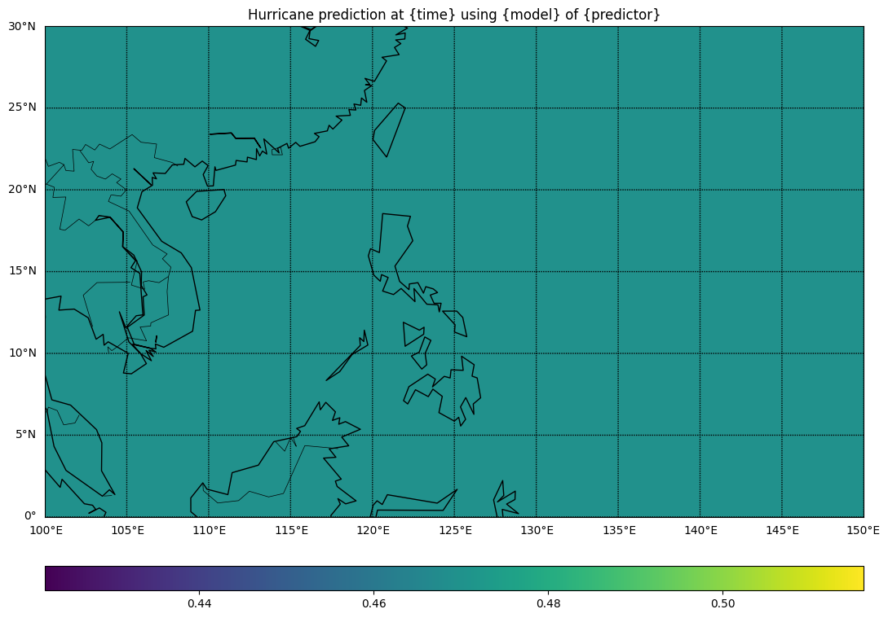

# Tropical Cyclone Prediction Pipeline (TCP-Pipepline)

This repository provides a pipeline to execute any tropical cyclone (TC) predictor on a predetermined geographical area (e.g., Western North Pacific Basin). The input dataset is obtained via performing a window sliding through all the area, wherein each sample (or window) has a fixed dimension (`17x17` in the provided dataset).


### Prerequisites
* Typhoon prediction engines: Provided in `./libtcg_PredictEngines/PipelineTC` (forked from the repo [PipelineTC](https://github.com/AnhDucHoangGia/PipelineTC/) of VNU-UET team)
* Datasets: `ncep-fnl` or `nasa-merra2` (in `*.nc` format)

### Input

* Input folder: `./data/input`
* Input files: NetCDF (`*.nc`, `*.nc4`) files containing weather data at ONE timestamp.

### Output

* One NetCDF file (`*.nc`) containing the prediction result for the considering sample (continuous value ranging in `[0,1]`)
* One rendered plot from prediction result (`*.pdf`).



### Local usage (interactive)

* Python command to perform typhoon formation prediction on all data provided in `./data/input/predict` folder:\
  `python predict.py ./data/input/predict`

* For more complex usages, see `python predict.py -h`

```console
$ python predict.py -h
usage: predict.py [-h] [-o OUTPUT] [-d] [-m MODEL_TYPE] [-p MODEL_PATH] [-n] [-i CONCURRENT_PROCESS_COUNT] [-t CONCURRENT_THREAD_COUNT] input

positional arguments:
  input                 Input folder. Example: './data/input/sample4'

options:
  -h, --help            show this help message and exit
  -o OUTPUT, --output OUTPUT
                        Output folder. Example: './data/output'
  -d, --delete-temp-files
                        Delete temporary data files.
  -m MODEL_TYPE, --model-type MODEL_TYPE
                        Model name
  -p MODEL_PATH, --model-path MODEL_PATH
                        Model path
  -n, --no-pdf          No pdf render.
  -i CONCURRENT_PROCESS_COUNT, --concurrent-process-count CONCURRENT_PROCESS_COUNT
                        Number of concurrent process.
  -t CONCURRENT_THREAD_COUNT, --concurrent-thread-count CONCURRENT_THREAD_COUNT
                        Number of concurrent thread per process.
```

### Usage in BigRed200 (Slurm job)

* To execute this code on BigRed200 (i.e., submit a Slurm job), please use the template from `demo-predict.sh` and modify the command based on [Usage (interactive)](#usage-interactive).
* Data path: `/N/u/tqluu/BigRed200/@PUBLIC/tc_predict-debug/`  
